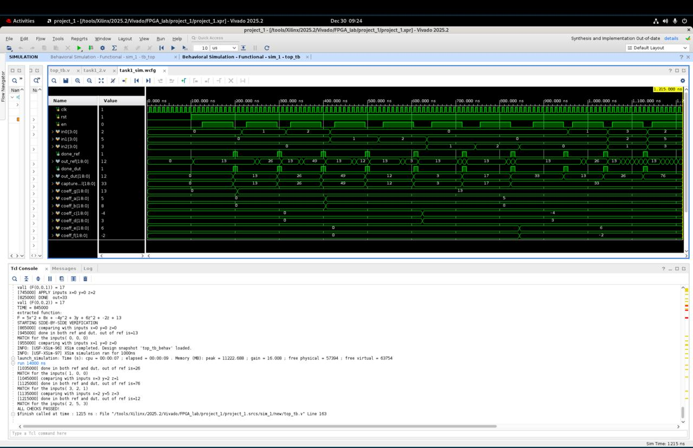

# FPGA task 1: Function extraction and hardware (re)design

## Project overview
Reverse-engineering of a mathematical function from a gate-level netlist "black box" and implementing a custom multi-cycle hardware redesign in Verilog.
---

### Identifying the function
The reference module operates on a quadratic function in the form:
$$F(x, y, z) = ax^2 + bx + cy^2 + dy + ez^2 + fz + g$$

* **Inputs ($x, y, z$):** These are 4-bit unsigned integers provided as `in0`, `in1`, and `in2`.
* **Coefficients ($a$ to $g$):** These are signed 5-bit constant values hidden within the reference netlist.
* **Outputs:** The module produces a signed 19-bit result and a `done` signal upon completion.

---

## 2. Extraction and solution
The solution was developed through a two-step process of extraction and implementation.

### Extraction Phase
Using the testbench (`top_tb.v`), specific input combinations were applied to isolate the hidden coefficients.
* **Constant $g$:** Found by setting all inputs to zero ($F(0,0,0) = 13$).
* **Coefficients $a$ and $b$:** Found by testing $x=1$ and $x=2$ while keeping $y$ and $z$ at zero.
* **Coefficients $c, d, e, \text{and } f$:** Extracted using similar algebraic isolation for $y$ and $z$ inputs.

---

## 3. Testbench architecture (`top_tb.v`)
The testbench uses two primary tasks (helpers) to automate the discovery and verification process:

##### `run_test_case_and_capture`
* Interrogates the reference "black box", applies inputs, asserts the enable signal, and waits for the reference `done` signal.

##### `run_compare`
* Validates the custom design against the reference.

---

## 4. Hardware redesign (`task1_2.v`)
The redesign uses a **multi-cycle state machine** to break the complex equation into manageable steps.

#### 3-bit state machine
The calculation is distributed over 8 clock cycles to optimize timing and resource usage.

| State | Name | Operation |
| :--- | :--- | :--- |
| `3'd0` | `S_LOAD_G` | loads the constant **13** into the accumulator. |
| `3'd1` | `S_CALC_AX2` | adds $5x^2$ to the running total. |
| `3'd2` | `S_CALC_BX` | adds $8x$ to the running total. |
| `3'd3` | `S_CALC_CY2` | adds $-4y^2$ to the running total. |
| `3'd4` | `S_CALC_DY` | adds $3y$ to the running total. |
| `3'd5` | `S_CALC_EZ2` | adds $6z^2$ to the running total. |
| `3'd6` | `S_CALC_FZ` | adds $-2z$ to the running total. |
| `3'd7` | `S_DONE` | outputs the result and asserts the `done` signal. |

## 5. Simulation Results
Below is the behavioral simulation showing the side-by-side verification of the reference model and the custom hardware redesign.

* **Verification:** The `out_ref` and `out_dut` signals match exactly for all tested input cases.
* **Timing:** Each calculation cycle completes after the 3-bit state machine reaches the `S_DONE` state.

---

### Design highlights
* 4-bit unsigned inputs are zero-extended to 6-bit signed values to ensure correct signed multiplication.

---
