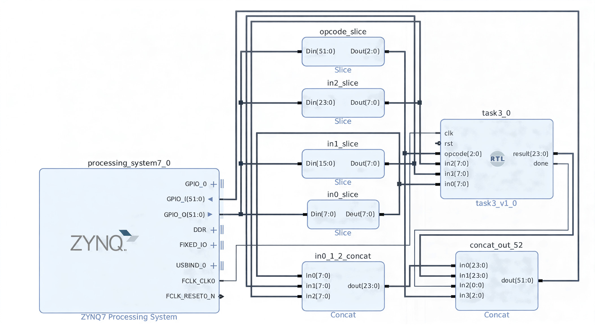

# Task 3: PS-PL GPIO Calculator (on PYNQ-Z2)

An instructional end-to-end PS-PL calculator example using EMIO GPIO, a Vivado block design, Verilog RTL, and a PYNQ Python driver (Jupyter notebook).  
Verified on a PYNQ board. The ALU operations (opcodes 0–6) and the sequential polynomial (opcode 7) operate correctly.

---

## What this project demonstrates

A software program running on the Processing System (PS) can control a small calculator in the Programmable Logic (PL) using EMIO GPIO:

---

## Table of Contents

1. [Background: GPIO and EMIO explained](#1-background-gpio-and-emio-explained)
2. [The Vivado block design: purpose and explanation](#2-the-vivado-block-design-purpose-and-explanation)
3. [Short AXI note (very high-level)](#3-short-axi-note-very-high-level)
4. [Detailed walkthrough of the RTL (task3.v)](#4-detailed-walkthrough-of-the-rtl-task3v)
5. [HDL wrapper and the block design wiring](#5-hdl-wrapper-and-the-block-design-wiring)
6. [Bitstream and hardware handoff](#6-bitstream-and-hardware-handoff)
7. [Booting the PYNQ board and writing the SD card (brief guide)](#7-booting-the-pynq-board-and-writing-the-sd-card-brief-guide)
8. [Network setup: static IP and verification commands](#8-network-setup-static-ip-and-verification-commands)
9. [Jupyter server](#9-jupyter-server)
10. [SSH tunneling to access the remote Jupyter server](#10-ssh-tunneling-to-access-the-remote-jupyter-server)
11. [Files placed in the notebooks directory and their roles](#11-files-placed-in-the-notebooks-directory-and-their-roles)
12. [Python MMIO variables and read/write logic](#12-python-mmio-variables-and-readwrite-logic)
13. [Why logical shifts are used](#13-why-logical-shifts-are-used)
14. [execute_calculation(x, y, z) function](#14-executecalculationx-y-z-function)
15. [Challenges encountered and why certain permissions were set](#15-challenges-encountered-and-why-certain-permissions-were-set)
16. [Troubleshooting checklist (concise)](#16-troubleshooting-checklist-concise)
17. [Potential extensions to the project (maybe)](#17-potential-extensions-to-the-project-maybe)
18. [Useful commands and snippets](#18-useful-commands-and-snippets)


## 1. Background: GPIO and EMIO explained

### What is a GPIO?
A general purpose input/output (GPIO) is a simple digital pin that can be configured as an input or output.

### What is EMIO and how is it different from MIO?
- **MIO (Multiplexed I/O):** physical PS pins routed outside the chip. Limited in number and multiplexed with PS peripherals.  
- **EMIO (Extended MIO):** when PS GPIO is routed into the PL fabric. EMIO is used to connect the PS to custom PL logic without requiring external board pins.

EMIO is used in this project because it provides a flexible internal connection between PS and PL, enabling a custom 52-bit protocol to be built without changing board wiring or consuming external pins.

### Why did I used GPIO instead of AXI?
- GPIO approach makes the PS-PL boundary and its pitfalls visible: non-atomic writes, direction conflicts, and tri-state behavior.  
- AXI is the professional industrial bus for production; however, its complexity was obscure for the basic learning points.  
- GPIO seemed simpler and showed the root causes of many rissues that later matter when building AXI peripherals.

---

## 2. The Vivado block design: purpose and explanation

### What is a block design?
A block design is a graphical representation of IP blocks and their interconnections in Vivado. It is used to wire IP (processing_system7, slice, concat, custom RTL) and automatically generate a top-level wrapper and handoff files.

### Why block design was used
- Manually wiring 52 bits and many slices/concats is error-prone.  
- The block design produces a correct top wrapper and a hardware handoff file (.hwh) required by PYNQ.  
- It simplifies connecting `FCLK_CLK0` from the PS to the PL module and ensures consistent signal naming.

### What the block design contains (high-level)
- `processing_system7_0` — the Zynq PS, provides EMIO GPIO and FCLK clock.  
- `task3_0` — the PL accelerator (the `task3.v` RTL).  
- `Slice` IPs — used to extract specific bitfields (opcode, in0, in1, in2) from the 52-bit EMIO bus.  
- `Concat` IPs — used to pack the three 8-bit inputs or to assemble the 52-bit EMIO output from `result`, `done`, and other fields.

A screenshot of the block design is attached, each slice and concat is labeled. You can visually map which EMIO bits feed which `task3` port.



### Why the clock is required
- The PL module contains sequential logic (FSM and registers). A synchronous `clk` must be provided to the PL (via `FCLK_CLK0`). The clock drives the FSM and the calculator updates for operation 7.

### How the 52 bit bus is mapped
- Lower 32 bits are mapped to bank 2 (EMIO 0..31) and cover the packed inputs: `in0`, `in1`, `in2`.  
- Upper bits are mapped to bank 3 (EMIO 32..63) and cover `result`, `done`, and `opcode`.  
- `Concat` primitives were used to assemble/disassemble the wide EMIO word into fields.

---

## 3. short AXI note (very high-level)
- AXI is a robust memory-mapped bus commonly used in industry.  
- AXI-Lite would be suitable for register-style peripherals and would avoid many polling pitfalls.  
- AXI was intentionally not used here to keep the focus on the PS-PL boundary mechanics and to keep the design small (and more educational for me).

---

## 4. Detailed walkthrough of the RTL (`task3.v`)

The Verilog file `task3.v` implements two functional parts: a combinational ALU and a sequential polynomial FSM.

### Ports (what is connected)
- `clk`, `rst` — clock and active-high reset.  
- `opcode[2:0]` — instruction field (bits [51:49] of the EMIO word).  
- `in2[7:0]`, `in1[7:0]`, `in0[7:0]` — packed 8-bit operands (x, y, z respectively).  
- `result[23:0]` — 24-bit output field (bits [47:24] of the EMIO word).  
- `done` — completion flag (bit 48).

### Combinational ALU (opcodes 0–6)
- Implemented as a combinational `always @(*)` block that sets `comb_result` based on `opcode`.  
- Operations implemented:
  - opcode 000: `in1 + in2`  
  - opcode 001: `in2 - in1`  
  - opcode 010: `in1 * in2`  
  - opcode 011: logical right shift `in2 >> in1`  
  - opcode 100: `in1 * in1`  
  - opcode 101: `in1 * in1 * in1`  
  - opcode 110: `in1 + in2 + in0`  
- The combinational path writes `result` immediately and asserts `done` (level-based).

### Polynomial FSM (opcode == 7)
- Polynomial: `F(x,y,z) = 5x² + 8x − 4y² + 3y + 6z² − 2z + 13` was the solution from Task 1.
- Implementation details:
  - Inputs and opcode are **latched** into `_reg` signals at FSM start (`opcode_reg`, `x_reg`, `y_reg`, `z_reg`), preventing corruption due to partial writes from PS.  
  - A signed calculator (`acc`) is used to allow negative coefficients.  
  - The FSM steps through states (`S_IDLE`, `S_AX2`, `S_BX`, `S_CY2`, `S_DY`, `S_EZ2`, `S_FZ`) and adds each term in sequence.  
  - On completion, `result` is sign-extended and `done` is asserted until the next operation.

### Latching inputs
- PS writes the 52-bit EMIO word via two 32-bit write operations (DATA2 and DATA3). These writes are non-atomic; during the two writes, some fields can be transiently inconsistent. By latching inputs at FSM start, the PL computes using a stable snapshot.

### Why `done` is level based?
- `done` ensures the PS polling loop (in Python) cannot miss the completion. If `done` were only a 1-cycle pulse, the polling loop could miss it depending on scheduling and timing.

---

## 5. HDL wrapper and the block design wiring

- The block design’s `Slice` and `Concat` IPs effectively act as the wrapper that maps the wide EMIO bus to the narrower `task3` ports.  
- The wrapper simplifies top-level wiring and avoids manual mistakes. Vivado generates the wrapper and .hwh file that PYNQ requires.

---

## 6. bitstream and hardware handoff 

- `task3.bit` (bitstream) programs the FPGA fabric with the synthesized PL design. Without it, the calculator is not present in the device.  
- `task3.hwh` (hardware handoff) contains metadata about ports and is used by PYNQ to build an `Overlay` object and to understand PL resources.  
- The Python driver interacts with registers that correspond to the wiring described in the HWH/top design. Loading the bitstream is required before running the Python notebook; the .hwh ensures the PL layout matches what the Python driver expects.

---

## 7. Booting the PYNQ board and writing the SD card (brief guide)

0. In the lab environment, we were provided with images already installed. But for documentation purposes I am hereby providing how to write image.
1. Download the recommended PYNQ image for the board.  
2. Flash the image to an SD card using `balenaEtcher` or `dd`. Example (shell):
   
    ```
    sudo dd if=pynq_image.img of=/dev/sdX bs=4M status=progress && sync
    ```

3. Insert the SD card, power on the board, and connect via USB or Ethernet. The default user is usually `xilinx`.  
4. Verify the board boots into Linux and that SSH is available.

---

## 8. Network setup: static IP and verification commands

Two common networking approaches are used: (1) USB gadget mode with `10.42.0.x` addresses and (2) an Ethernet connection with a /24 network.

### example static IP assignment (temporary, on the board)
- Board IP: `10.42.0.2`
- Host (Mac) IP: `10.42.0.1`
- Netmask: `255.255.255.0`

commands to set a temporary IP on the board:
    
    ```
    sudo ifconfig eth0:1 inet 10.42.0.2 netmask 255.255.255.0
    ```

commands to check addresses and ports on the board:
    
    ```
    hostname -I
    ifconfig -a
    ip addr show
    ss -tulpn | grep 8888
    sudo lsof -i:8888
    sudo systemctl status jupyter
    ```

network scanning examples (from host):
    
    four-space indented code block for example
    ```
    nmap -sP 10.42.0.0/24
    for i in {2..255}; do ping -c 1 -W 1 10.42.0.$i; done
    ```

---

## 9. Jupyter server

Two commands were used to prepare and start Jupyter:

1. Environment setup
    ```
    source /etc/profile.d/pynq_venv.sh
    ```

    - This script sets environment variables so the PYNQ virtual environment and packages are visible to the shell (PATH, PYTHONPATH, etc.).

2. Start the Jupyter server (as root while preserving environment)
    ```
    sudo -E /usr/local/share/pynq-venv/bin/jupyter notebook \
      --ip=0.0.0.0 \
      --port=8888 \
      --no-browser \
      --allow-root \
      --NotebookApp.token='' \
      --NotebookApp.password=''
    ```

Explanation of key flags and reasons:
- `sudo -E` preserves the environment variables previously set by the `source` command, which is required if the server is launched as root.  
- `--ip=0.0.0.0` binds the server to all interfaces so remote hosts can connect.  
- `--allow-root` is used only when launching under root. Running as the normal user is preferable where possible.  
- `--NotebookApp.token='' --NotebookApp.password=''` disables token/password auth for a trusted lab network (use with caution).

**common issues and best practice**
- Running Jupyter as root may place runtime files in `/root/.local`, was causing permission issues if the notebook later tries to write under a different user. Changing ownership (chown) to the active user is safer than broad chmod changes.  
- If an existing Jupyter service is running via systemd or nginx is acting as a proxy, check `systemctl` and `nginx` status and manage conflicts.

---

## 10. SSH tunneling to access the remote Jupyter server

SSH local port forwarding can avoid network routing issues:

    ```
    ssh -L 8888:localhost:8888 xilinx@10.42.0.2
    ```

After the tunnel is active, open `http://localhost:8888` on the (host) laptop; the remote Jupyter will be reachable locally.

---

## 11. Files placed in the notebooks directory and their roles

- `task3.bit` — FPGA bitstream that programs the PL.  
- `task3.hwh` — hardware handoff describing PL ports (used by PYNQ).  
- `task3.ipynb` — Jupyter notebook driver that loads the overlay, configures GPIO, and runs tests.  
- `task3.v` — RTL source for the accelerator, included for reference.

---

## 12. Python MMIO variables and read/write logic

Key constants and their meanings:

    ```
    GPIO_BASE = 0xE000A000

    DATA2_RO  = 0x068   # bank2 read-only (EMIO 0..31)
    DATA3_RO  = 0x06C   # bank3 read-only (EMIO 32..63)
    DATA2     = 0x048   # bank2 write register
    DATA3     = 0x04C   # bank3 write register

    DIRM2     = 0x284   # bank2 direction register (1=output)
    DIRM3     = 0x2C4   # bank3 direction register
    OEN2      = 0x288   # bank2 output enable
    OEN3      = 0x2C8   # bank3 output enable
    ```

- `GPIO_BASE` the base address of the GPIO register block in the SoC memory map, defined by the chip’s architecture.
(see [here](https://docs.amd.com/r/en-US/ug585-zynq-7000-SoC-TRM/Register-gpio-XGPIOPS_DATA_LSW_OFFSET))
- `DATAx` writes apply to PS-driven outputs when direction and OEN are enabled.  
- `DATAx_RO` returns the actual pin levels, which may be driven by PL or PS (RO stands for read-only).  
- `DIRMx` (direction mode) configures per-bit direction; `1` means the PS is configured to drive the pin.  
- `OENx` (output enable NOT, means active low) must be set alongside DIRM to actually enable the physical driver transistor; otherwise the pin remains tri-stated .

### Direction masks
- Earlier tests used `0xFFFFFFFF` (all pins as PS outputs) which caused PL–PS contention.  
- Correct direction masks were used to allow the PS to drive only the input fields and opcode while letting the PL drive `result` and `done`. Example:

    
    ```
    mmio.write(DIRM2, 0x00FFFFFF)   # PS drives bits 0..23 (inputs)
    mmio.write(OEN2,  0x00FFFFFF)

    opcode_mask = (0x7 << (49 - 32))  # opcode bits mapped into bank3 index
    mmio.write(DIRM3, opcode_mask)
    mmio.write(OEN3, opcode_mask)
    ```

Explanation: `0x00FFFFFF` sets bits 0..23 as PS outputs (inputs to PL). Bits 24..31 remain inputs so the PL can drive those result bits. The opcode bits in bank 3 are set as PS outputs; the rest are left for PL.

### Packing and shifting in Python
- Inputs are packed into a 24-bit field:

    ```
    inputs_packed = ((in2 & 0xff) << 16) | ((in1 & 0xff) << 8) | (in0 & 0xff)
    ```

- The full 52 bit protocol word is built by placing the opcode and inputs into the right bit positions:

    ```
    word_out = (inputs_packed & MASK_24) | ((opcode & MASK_3) << OPCODE_LSB)
    ```

- The lower 32 bits are written to `DATA2` and the upper 32 bits to `DATA3`, mirroring the controller register granularity.

### Readback
- `DATA2_RO` and `DATA3_RO` are polled and reassembled into `full_word`:

    ```
    full_word = (high_bits << 32) | (low_bits & 0xffffffff)
    done = (full_word >> DONE_BIT) & 0x1
    result = (full_word >> RESULT_LSB) & MASK_24
    ```

- The `done` bit and `result` are extracted using shifts and masks.

---

## 13. Why logical shifts are used
- Python’s right shift on non-negative integers behaves as a logical shift (zeros are shifted in). The Python driver treats bitfields as unsigned for packing/unpacking. Signed arithmetic is handled inside the PL RTL, where signal widths and signedness are declared explicitly. Therefore logical shifts were sufficient and appropriate in the driver.

---

## 14. execute_calculation(x, y, z):

1. Build a stable 52-bit word from `opcode`, `in0`, `in1`, `in2`.  
2. Write the lower 32 bits to `DATA2` then the upper bits to `DATA3`.  
   - This mirrors the hardware register layout and is required because the GPIO controller operates on 32-bit registers.  
3. Poll `DATA2_RO` and `DATA3_RO` to reconstruct the live `full_word`.  
4. Check the `done` bit at `DONE_BIT`. If set, extract `result` and return a `CalcResult(opcode, result, True)`.  
5. After a timeout, return `CalcResult(opcode, 0, False)` to indicate failure/timeout.

Design considerations:
- Polling is used because a simple interrupt handshake was not added; for larger projects an interrupt line or AXI-Lite with interrupts would be more efficient.  
- A timeout prevents infinite loops when hardware misbehaves.

---

## 15. Challenges encountered and why certain permissions were set

- A permission-related failure (Jupyter returning 500 errors) was encountered if the Python environment or notebook directories were not accessible by the running user. To avoid runtime errors, the following permissions were applied in the lab environment:
    
    ```
    sudo chmod 755 /usr/local/share/pynq-venv
    sudo chmod 755 ~/jupyter_notebooks
    ```

- Rationale: `chmod 755` allows the process to traverse and read the directories. A safer approach is to change ownership to the running user (`chown xilinx:xilinx ...`) rather than relaxing perms globally. In some PYNQ images the Jupyter server is run as root or via systemd requiring careful handling.

---

## 16. Troubleshooting checklist (concise)

- Verify the bitstream is loaded: the PL should be programmed with `task3.bit`.  
- Confirm `Overlay("task3.bit")` succeeds and the overlay reports loaded status.  
- Check GPIO direction registers and output enables (`DIRM2`, `DIRM3`, `OEN2`, `OEN3`).  
- Read back `DATA2_RO` and `DATA3_RO` to inspect live bits.  
- Confirm the FSM latches inputs on opcode 7; transient reads indicate partial writes.  
- Check Jupyter service and port presence (`ss -tulpn | grep 8888`).  
- Use SSH port forwarding if network routing blocks direct access.

---

## 17. Potential extensions to the project (maybe)

- Migrating the interface to AXI-Lite for a production-grade peripheral.  
- Add a formal verification test for the FSM or a unit testbench for the Verilog module.

---

## 18. useful commands and snippets

board introspection and network checks:

    four-space indented code block for example
    ```
    hostname -I
    ip addr show
    ss -tulpn | grep 8888
    sudo lsof -i:8888
    sudo systemctl status jupyter
    ```

check GPIO registers using Python MMIO:

    four-space indented code block for example
    ```
    from pynq import MMIO
    mmio = MMIO(0xE000A000, 0x1000)
    print(hex(mmio.read(0x284)))  # DIRM2
    print(hex(mmio.read(0x2C4)))  # DIRM3
    print(hex(mmio.read(0x048)))  # DATA2 (write)
    print(hex(mmio.read(0x068)))  # DATA2_RO (read)
    ```

---

For any questions, don't hesitate to open an issue under Task 3.
